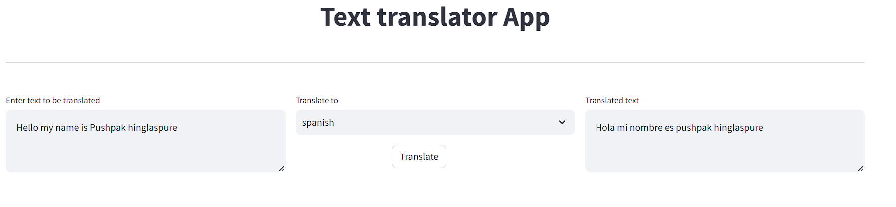

# Text Translator App
This Streamlit app allows users to translate text from one language to another using the Google Translate API.


## Key Features

- Input text to be translated
- Select the desired target language
- Click the "Translate" button to see the translated text
## Installation

1. Clone this repository:

```bash
git clone https://github.com/phinglaspure123/Text-Translator-App.git
```
2. Navigate to the project directory:

```bash
cd Text-Translator-App
```
3. Install the required dependencies:
```bash
pip install -r requirements.txt
```
4. Run the app:
```bash
streamlit run app.py
```
## Usage

1. Enter the text you want to translate in the text area provided.
2. hoose the target language from the dropdown menu.
3. Click the "Translate" button.
4. The translated text will appear in the adjacent text area.

## Screenshots


## Authors

- [@phinglaspure123](https://github.com/phinglaspure123)

